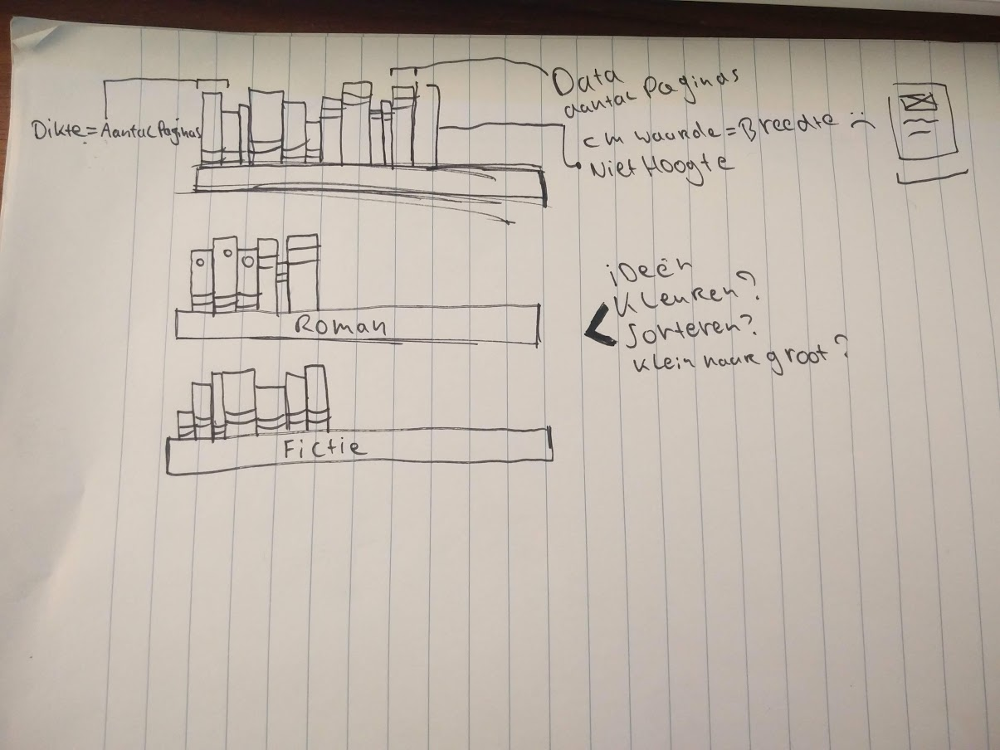
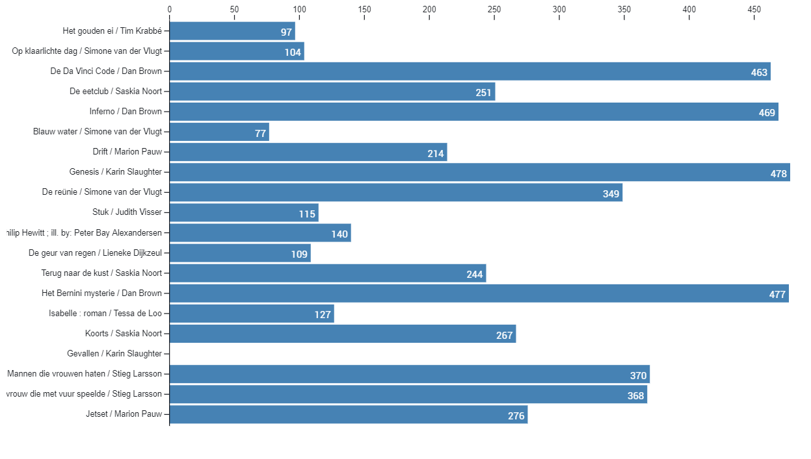
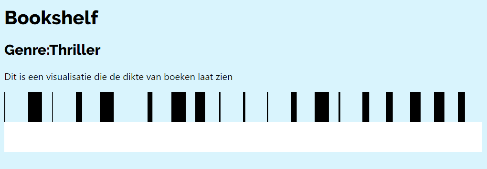
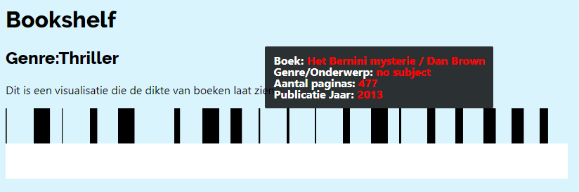

## Functional Programming

Dit is mijn readme over het vak FP, hierin beschrijf ik mijn onderzoek en het proces
[Live demo](https://boekenplank.netlify.com/)

### Onderzoeks vragen:

**1. Hoe vaak komen scheldwoorden voor in titels van boeken**

###### Deelvragen:

-   Is sinds de komst van het internet/social media de titels van boeken grover geworden?

**2. In hoeverre hebben historische gebeurtenissen impact op de dikte van boeken? 
(Gekozen onderzoekvraag)**


###### Deelvragen:

-   welk jaar zijn de dikste boeken uitgekomen?

-   In welk jaar zijn de dunste boeken uitgekomen?
-   Welk genre bevat gemiddeld de meeste pagina's

**3. Hoe is het kleurgebruik op de kaft van boeken de afgelopen jaren veranderd?**

###### Deelvragen:

-   Hoe is het kleurgebruik van covers veranderd in de loop der jaren?
-   Hoe is het kleur per genre in de loop der jaren veranderd?
-   Welke kleur komt het meest voor in het genre Horror?

**4. In welke maand komen de meeste boeken uit?**

###### Deelvragen:

-   Komen in de zomermaanden meer romans uit?
-   Komen in de wintermaanden meer thrillers uit?

### Proces

In de eerste ben ik de oba-api gaan onderzoeken met de [oba-api](https://github.com/rijkvanzanten/node-oba-api) wat viel er te zien en wat kan je ophalen. In het begin was het wat overweldigend. En vond ik het lastig om bruikbare data te vinden. Al snel kwam Daniel met een uitgebreide [doc](https://github.com/DanielvandeVelde/functional-programming#cheatsheet) over de api en wat er allemaal inzat. Nu dit wat duidelijker was heb ik begonnen met het bedenken van onderzoeksvragen. Al snel kwam ik op het idee om de dikte van boeken te willen laten zien.

Na het onderzoeken van de physical-description bleek de cm waarde de breedte van het boek te zijn. ik heb mn deel vraag dus aangepast. Ik ben nu bezig met schrijven van een functie waarmee ik het aantal pagina's uit de api kan halen. Dit staat vaak als "323 p" in de data. Op het moment loop ik tegen het schoonmaken van de data aan. Hiermee ben ik gisteren de hele dag bezig geweest. Met hulp van @timruiterkamp ben ik een stuk verder gekomen.

Ik krijg nu de data schoon terug door een regex expressie, thanks to Daniel.

### The Data:
Dit is de data die ik uit de Oba API heb kunnen halen in de eerste week kon ik alleen maar bij de description komen. Dit kwam doordat ik nog niet goed doorhad hoe je een object met data kan vullen.

| Title                | Description |	Publication |	Subject	|
| -------------------- | ----------- | -------- 	| ----------|
| physical description | het aantal paginas |Publicatie jaar	| Onderwerp		|

#### Visualisatie schets
Nadat ik de wist welke data ik kon gebruiken ben ik gaan schetsen.
Dit is de eerste schets van mijn visualistie idee, ik wil een fysieke boekenplank maken met hierop de boeken per genre. de dikte van de boeken wordt afgeleid uit het aantal pagina's.



Mijn code leek te werken maar ik vond het zelf lastig het begrip functional programming te doorgronden. Omdat ik hier meer over wilde weten ben ik het boek "Mastering Javascript Functional Programming" gaan lezen. Dit is beschikbaar via de O'reilly website. De code die in het boek wordt behandeld is vrij geavanceerd maar wordt goed en duidelijk uitgelegd. De uitleg over de map functie heeft mij veel geholpen. Ik heb mijn code met de hup van Dennis wat functioneler gemaakt door boven in de code het object te maken en het object. Hierna door een opschoon functie te halen.

```javascript
    let results = response.data.aquabrowser.results[0].result

		return results.map(book => {

			return {
				title: book.titles[0].title[0]['_'],
				description: book.description[0]['physical-description'][0]._,
				publication: book.publication[0].year[0]['_'],
				subject: book.subjects ? book.subjects[0]['topical-subject'][0]._ : "no subject",
			}
		})
	})

```

Ik liep tegen het maken van de schaal aan, na het lezen van onderstaand medium artikel en het volgen van Udemy course werd dat een stuk duidelijker. Ik blijf het lastig vinden om bepaalde veranderingen te kunnen verklaren in D3. D3 Heeft zoveel mogelijkheden en ik heb veel tijd gestoken in het positioneren van de boeken. Dit is nog niet helemaal gelukt. Naast het positioneren van de boeken heb ik lang zitten denken om een functie te maken die de hoogte van de boeken bepaald. Nu wordt alleen de breedte bepaald maar de hoogte is overal gelijk. In de data-set zit geen hoogte van de boeken. Ik heb hierna besloten verder te gaan met het maken van een tooltip. Wanneer iemand met zijn muis op een boek gaat staan moet deze meer informatie geven over het boek. Dit is gelukt mede door de uitgebreide tutorial van Udemy.


Ik heb tijdens mijn proces de onderzoeks vragen niet kunnen beantwoorden maar dat vind ik niet heel erg. De insteek voor mij was meer leren over D3, en uiteindelijk voor mij de boekenplank visualiseren. Dit is tot op zekere hoogte gelukt alleen heb ik de laatse dagen de focus gelegd op het correct tonen van de data en niet zozeer de styling dit was in mijn ogen een doel voor later.

 nou is het door Obserable vrij makkelijk om een standaard barchart of andere grafiek te maken. Ook ik heb in observerable een chart gemaakt om per boek het aantal pagina's te tonen. Dit was vrij snel gedaan juist doordat ik dit zo zag dacht ik dit moet interessanter kunnen. Hierna heb ik mij volledig gefocust op het maken van de boekeplank.



#### Leermomenten:
In de tweede week heb ik veel geleerd over het simpeler maken van m'n code waar ik eerst veel moeite deed om een object te maken en deze te returnen. Werd na een uitleg van Dennis alles een stuk duidelijker. Ook door het lezen van het boek over functioneel programmeren heb ik it begrip wat beter kunnen doorgronden. Hierna heb ik mij gestort op het maken van de dataviz in D3. Ik heb veel geleerd over D3 en dan met name dat het een zeer veelzijdige tool is. Daarnaast ook over SVG en hoe dit kan worden gebruikt in combinatie met D3.


#### Resultaat

Dit is het uiteindelijke resultaat van de dikte van 19 boeken in het genre Thriller.




#### Hulp & Bronnen:

[Freecodecamp article](https://medium.freecodecamp.org/a-gentle-introduction-to-d3-how-to-build-a-reusable-bubble-chart-9106dc4f6c46)

[Udemy course](https://www.udemy.com/masteringd3js)

[Functional programming book](https://www.safaribooksonline.com/library/view/mastering-javascript-functional/9781787287440/68705aac-6c78-42fb-8f88-3635de5819d2.xhtml)

#### Helden
[Tim](https://github.com/timruiterkamp)

[Dennis](https://github.com/Denniswegereef)
